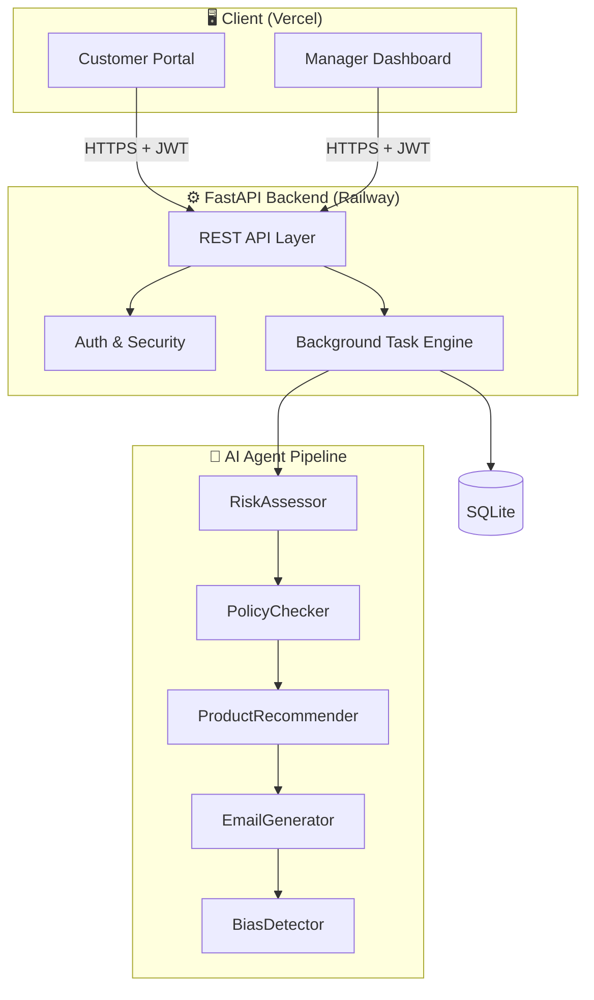

<div align="center">

# LoanWise AI

### AI-Powered Loan Origination Platform

[](https://fastapi.tiangolo.com)
[](https://react.dev)
[](https://python.org)
[](https://typescriptlang.org)
[](https://aistudio.google.com)
[](LICENSE)

An intelligent lending system that automates the full loan origination workflow — from application to decision — using a **multi-agent AI pipeline** built on Google Gemini 2.5 Flash with OpenAI fallback and deterministic heuristics.

[**Live App**](https://loanwise-ai-weld.vercel.app/) · [API Docs](https://loanwise-ai-backend-production.up.railway.app/docs) · [Deployment Guide](docs/DEPLOYMENT.md)

</div>

---

## Table of Contents

- [Overview](#overview)
- [Key Features](#key-features)
- [System Architecture](#system-architecture)
- [AI Agent Pipeline](#ai-agent-pipeline)
  - [Agent 1: RiskAssessor](#agent-1-riskassessor)
  - [Agent 2: ProductRecommender](#agent-2-productrecommender)
  - [Agent 3: EmailGenerator](#agent-3-emailgenerator)
  - [Agent 4: BiasDetector](#agent-4-biasdetector)
  - [Agent 5: DocumentVerifier](#agent-5-documentverifier)
  - [Extended AI: intake, policy, copilot & compliance](#extended-ai-intake-policy-copilot--compliance)
  - [Agent observability](#agent-observability)
  - [Orchestration & Fallback Strategy](#orchestration--fallback-strategy)
- [Risk Assessment Model](#risk-assessment-model)
- [Security](#security)
- [Tech Stack](#tech-stack)
- [Project Structure](#project-structure)
- [Getting Started](#getting-started)
- [Environment Variables](#environment-variables)
- [API Reference](#api-reference)
- [Deployment](#deployment)
- [Future Roadmap](#future-roadmap)
- [License](#license)

---

## Overview

LoanWise AI is a full-stack, production-grade loan origination platform designed for banks, fintech companies, and lending teams. It replaces manual underwriting with a **sequential multi-agent AI pipeline** that:

1. **Assesses creditworthiness** against CFPB, Fannie Mae, and FHA guidelines
2. **Recommends alternative products** for denied applicants
3. **Generates personalised decision letters** with warmth and clarity
4. **Screens all communications** for discriminatory language (CFPB compliance)
5. **Verifies supporting documents** via AI-powered extraction  
6. **Pre-submission intake review** for applicants (readiness score, flags, suggestions)  
7. **Manager copilot briefs** and **compliance narratives** (ECOA-style text + customer FAQ)  
8. **Configurable lending policy** checked during underwriting, with **agent observability** (latency, model) in the dashboard

Every decision is fully explainable — customers see exactly which factors influenced the outcome.

> **Target users:** Risk analysts, loan underwriters, fintech operations teams, and lending startups.

---

## Key Features

| Feature | Description |
|---------|-------------|
| **Multi-agent AI pipeline** | Core underwriting flow (risk → optional policy → recommendations → email → bias) plus document fusion, intake, copilot, and compliance agents |
| **Dual AI provider** | Gemini 2.5 Flash as primary; OpenAI GPT-4o-mini as fallback; heuristics as last resort |
| **Explainable decisions** | Risk factors, contributions, and industry thresholds shown for every application |
| **Bias auto-remediation** | BiasDetector triggers automatic email rewrites if discriminatory language is detected |
| **Product recommendations** | Contextual alternative products for denied applicants with personalised match scores |
| **Document intelligence** | AI-powered extraction and cross-validation of payslips, IDs, and bank statements |
| **Document–risk fusion** | Verified uploads summarized into the pipeline; high-severity mismatches surface in risk logs |
| **Intake advisor** | Authenticated `POST /loan/intake-review` + review-step UI before submit |
| **Manager copilot** | Pre-decision brief (checklist, suggested action, questions) on loan detail while `pending_review` |
| **Compliance narrative** | Regulator-style narrative + customer FAQ for completed loans; copy-to-audit flow |
| **Lending policy pack** | Managers edit plain-English policy in Settings; **PolicyChecker** runs when policy is set |
| **Agent observability** | `agent_logs` stores `latencyMs` and `model`; Agent Activity filters by agent and status |
| **Pipeline progress UI** | Step-aligned percent + transform-based bar so the bar matches the on-screen percentage |
| **Manager dashboard** | Real-time analytics, loan queue, AI decisions, audit trail, CSV export |
| **Multi-step customer portal** | Guided application with real-time validation and draft persistence |
| **Role-based authentication** | Clerk JWT with RS256 verification; roles stored server-side, never trusted from client |
| **Enterprise security** | OWASP Top 10 hardening — RLS, IDOR prevention, rate limiting, security headers |

---

## System Architecture



### Detailed Architecture

```
┌──────────────────────────────────────────────────────────────────────────────────┐
│                                   CLIENT                                          │
│                                                                                    │
│   ┌────────────────────────┐          ┌──────────────────────────────────────┐   │
│   │   Customer Portal      │          │       Manager Dashboard               │   │
│   │  ─────────────────     │          │  ──────────────────────────────────  │   │
│   │  • Multi-step form     │          │  • Loan queue & review               │   │
│   │  • Application status  │          │  • AI pipeline trigger               │   │
│   │  • Document upload     │          │  • Analytics & charts                │   │
│   │  • Eligibility check   │          │  • Audit trail & CSV export          │   │
│   └────────────┬───────────┘          └──────────────────┬───────────────────┘   │
│                │                                          │                        │
│          React 18 · Vite · TanStack Query · Clerk · shadcn/ui · Tailwind          │
└────────────────┼──────────────────────────────────────────┼───────────────────────┘
                 │  HTTPS + JWT (Bearer)                     │
                 ▼                                           ▼
┌──────────────────────────────────────────────────────────────────────────────────┐
│                               FASTAPI BACKEND                                     │
│                                                                                    │
│   ┌──────────────────┐  ┌──────────────────┐  ┌──────────────────────────────┐   │
│   │  Auth & Security │  │   REST API Layer  │  │   Background Task Engine     │   │
│   │  ──────────────  │  │  ─────────────── │  │  ──────────────────────────  │   │
│   │  • Clerk JWT/RS256│  │  • 30+ endpoints │  │  • FastAPI BackgroundTasks   │   │
│   │  • Role from DB   │  │  • Input validation│ │  • Retry (×2, exp. backoff) │   │
│   │  • Rate limiting  │  │  • CORS, headers │  │  • Status: queued→completed  │   │
│   │  • RLS policies   │  │  • Audit logging │  │  • Async + non-blocking      │   │
│   └──────────────────┘  └──────────────────┘  └──────────────────────────────┘   │
│                                    │                                               │
│                        SQLite (loanwise.db)                                       │
│          loans (incl. policyResult) · users · agent_logs · audit_logs · documents  │
└────────────────────────────────────┼─────────────────────────────────────────────┘
                                     │
                                     ▼
┌──────────────────────────────────────────────────────────────────────────────────┐
│                            AI AGENT PIPELINE                                      │
│                         pipeline.py · run_pipeline()                              │
│                                                                                    │
│  RiskAssessor (+ document fusion)                                                 │
│       → PolicyChecker (skipped if no lending policy in Settings)                   │
│       → ProductRecommender (only when risk decision is denied)                     │
│       → EmailGenerator → BiasDetector (with auto-remediation, ≤2 rewrites)        │
│                                                                                    │
│  Each LLM call: Gemini 2.5 Flash ──▶ OpenAI GPT-4o-mini ──▶ Heuristic fallback     │
└──────────────────────────────────────────────────────────────────────────────────┘
```

### Loan Status Lifecycle

```
         Customer submits
               │
               ▼
           ┌───────┐
           │ queued │  ◀─── Default state after submission
           └───┬───┘
               │  Manager triggers / autoProcess
               ▼
         ┌──────────┐
         │processing│  ◀─── Pipeline running in background
         └─────┬────┘
               │  Pipeline complete
               ▼
       ┌──────────────┐
       │pending_review│  ◀─── Awaiting manager approve/deny
       └──────┬───────┘
              │  Manager submits decision
              ▼
         ┌─────────┐
         │completed│  ◀─── Final state
         └─────────┘

    ─────────────────────────────────
    withdrawn  ◀── Customer or manager at any pre-completed stage
    error      ◀── Pipeline failed after 2 retry attempts
```

---

## AI Agent Pipeline

The **core underwriting pipeline** runs inside `run_pipeline()` in `backend/pipeline.py`. It loads **verified documents** from the DB (for fusion logging and risk context), optionally evaluates a **custom lending policy** from Settings, then runs recommendations, email generation, and bias screening. Agents share context — there is no external queue; orchestration uses FastAPI `BackgroundTasks` with a retry loop.

**On-demand agents** (IntakeAdvisor, ManagerCopilot, ComplianceNarrator) are exposed as separate authenticated routes and do not mutate core loan state except where noted (audit / agent logs).

```
Loan Data + verified_documents[] + optional lendingPolicy (from settings)
    │
    ▼
┌──────────────────────────────────────────────────────────────────────────────────┐
│  _run_pipeline_bg()  —  Retry: up to 2 attempts, exponential backoff (2s, 4s)   │
│                                                                                    │
│  run_pipeline(..., verified_documents=…, policy_text=…)                          │
│  ─────────────────────────────────────────────────────────────────                │
│                                                                                    │
│  1 ▶ RiskAssessor  (+ document fusion summary in agent log when uploads exist)   │
│      └─▶ risk_result: {riskScore, decision, factors[], reasoning, confidence}      │
│                                                                                    │
│  2 ▶ PolicyChecker (only if `lendingPolicy` is non-empty in settings)            │
│      └─▶ policyResult persisted on loan JSON column `policyResult`               │
│                                                                                    │
│  3 ▶ ProductRecommender — only if decision == "denied"                           │
│      └─▶ recommendations[]                                                         │
│                                                                                    │
│  4 ▶ EmailGenerator → personalised letter                                        │
│                                                                                    │
│  5 ▶ BiasDetector → auto-remediation rewrites (max 2)                            │
│                                                                                    │
│  ✓ Success → loan status = pending_review                                        │
│  ✗ Failure → loan status = error                                                 │
└──────────────────────────────────────────────────────────────────────────────────┘
```

### Agent 1: RiskAssessor

**Purpose:** Evaluates creditworthiness against CFPB, Fannie Mae conventional, and FHA guidelines.

| Input | Output |
|-------|--------|
| Income, credit score, loan amount, DTI, employment type, loan purpose | `riskScore` (0–1), `approvalProbability` (0–1), `decision`, `confidence`, `factors[4]`, `reasoning` |

**Output — 4 mandatory factors:**

| Factor | Threshold |
|--------|-----------|
| Credit Score | 670+ conventional; 580+ FHA |
| Debt-to-Income Ratio | ≤36% preferred; ≤43% FHA limit |
| Loan-to-Income Ratio | <3× conservative; >5× very high |
| Employment Type | Full-time preferred |

**Fallback chain:** Gemini 2.5 Flash → OpenAI GPT-4o-mini → Calibrated heuristic scoring

---

### Agent 2: ProductRecommender

> **Pipeline order:** In `run_pipeline`, **PolicyChecker** runs after RiskAssessor when a lending policy is configured, then ProductRecommender runs for **denied** applications only.

**Purpose:** Suggests the best-fit alternative financial products for denied applicants.

| Input | Output |
|-------|--------|
| Income, credit score, DTI, loan amount, denial factors | `recommendations[]` with `productName`, `matchScore` (0–100), `reason`, `rate` |

**Special behaviour:**
- Only runs when `decision == "denied"`
- Dynamically injects a **Reduced Loan offer** (75% of requested amount) when DTI is the primary blocker
- Results are passed to EmailGenerator so the denial letter includes the offers

**Catalog:** Personal Loan, FHA Mortgage, Credit Card, Savings Plan, Auto Loan, + dynamic Reduced Amount Loan

---

### Agent 3: EmailGenerator

**Purpose:** Writes a professional, warm, and personalised decision letter.

| Input | Output |
|-------|--------|
| Applicant name, loan ID, decision, factors, reasoning, optional recommendations | Plain-text email body (≤350 words) |

**Letter contents:**
- **Approved:** Congratulations, specific strengths cited, next steps (loan officer in 2 business days)
- **Denied:** Empathetic tone, specific factor values cited (e.g. "your DTI of 48%"), re-apply guidance in 90 days, "Next Best Offer" section with top 1–2 alternatives

---

### Agent 4: BiasDetector

**Purpose:** Screens all generated letters for CFPB fair lending compliance.

| Input | Output |
|-------|--------|
| Email text | `biasScore` (0–1), `toxicityScore` (0–1), `passed` (bool), `explanation` |

**Checks for:**
- Protected class references (race, religion, sex, age, national origin, disability, familial status, marital status)
- Toxic or demeaning language
- Vague denial reasons that could mask discrimination
- Unnecessarily harsh tone

**Auto-remediation:** If `passed == false`, the pipeline automatically triggers EmailGenerator to rewrite the letter. Up to **2 rewrites** before accepting the result.

```
BiasDetector detects issue
      │
      ▼
EmailGenerator rewrite #1
      │
      ▼
BiasDetector re-scans
      │ still failing?
      ▼
EmailGenerator rewrite #2  →  Accept result regardless
```

**Pass threshold:** `biasScore < 0.10` AND `toxicityScore < 0.10`

---

### Agent 5: DocumentVerifier

**Purpose:** Extracts structured data from uploaded documents and cross-validates against declared application data.

| Input | Output |
|-------|--------|
| Base64 document, doc type, declared income, declared name | `extractedFields`, `mismatches[]`, `passed`, `confidence`, `summary` |

**Supported document types:** payslip, NRIC/ID, bank statement, employment letter

**Mismatch severity:** low / medium / high — loan is flagged if any high-severity mismatch is detected

---

### Extended AI: intake, policy, copilot & compliance

| Capability | Where it runs | What it does |
|------------|---------------|--------------|
| **IntakeAdvisor** | `POST /loan/intake-review` (auth); portal review step | JSON: `readinessScore`, `flags[]`, `suggestions[]`, `summary`. Optional `loanId` to append an `agent_logs` row. Heuristic fallback if LLMs fail. |
| **PolicyChecker** | Inside `run_pipeline` when Settings → **Lending Policy** is set | Compares the application (and AI factors) to your plain-English policy; violations/warnings stored in `policyResult` on the loan. |
| **ManagerCopilot** | `POST /loans/:id/manager-brief` (manager only) | Executive bullets, suggested approve/deny/escalate, checklist, applicant questions. Logged to `agent_logs` and audit trail. |
| **ComplianceNarrator** | `POST /loans/:id/narrative` (manager or loan owner) | Only when `decision` is `approved` or `denied`. Returns `regulatorNarrative` + `customerFaq[]`; UI supports copy-to-clipboard. Audit event recorded. |

**Settings:** **Lending Policy** tab persists `lendingPolicy` via `PATCH /settings` (partial merge with other keys). Leave blank to skip PolicyChecker.

---

### Agent observability

Each row in `agent_logs` can include:

| Field | Purpose |
|-------|---------|
| `latencyMs` | Wall time for that agent call where instrumented |
| `model` | e.g. Gemini / OpenAI model id used for that step |

The **Agent Activity** page filters by agent name and status (including **warning**), shows latency in the table and detail dialog, and links to the loan when `applicationId` is set.

---

### Orchestration & Fallback Strategy

Every LLM call goes through the same three-tier fallback:

```
                    ┌─────────────────────────────┐
                    │         _llm(prompt)          │
                    └──────────────┬──────────────┘
                                   │
                    ┌──────────────▼──────────────┐
                    │    Gemini 2.5 Flash          │
                    │    temperature=0.2           │
                    │    max_tokens=2048           │
                    └──────────────┬──────────────┘
                         success   │  failure (429, timeout, etc.)
                                   │
                    ┌──────────────▼──────────────┐
                    │    OpenAI GPT-4o-mini        │
                    │    temperature=0.2           │
                    │    json_mode if needed       │
                    └──────────────┬──────────────┘
                         success   │  failure
                                   │
                    ┌──────────────▼──────────────┐
                    │    Heuristic Fallback        │
                    │    Deterministic Python      │
                    │    No API calls needed       │
                    └─────────────────────────────┘
```

| Orchestration Aspect | Detail |
|---------------------|--------|
| **Trigger** | `POST /loans/:id/process` (manager only) — returns immediately |
| **Execution** | FastAPI `BackgroundTasks` — non-blocking, no Redis/Celery needed |
| **Retries** | Up to 2 pipeline attempts; exponential backoff (2s, 4s) |
| **Context sharing** | Risk factors/reasoning → EmailGenerator; recommendations → EmailGenerator; optional `policyResult` on loan |
| **Audit trail** | `agent_logs`: timestamp, status, confidence; optional `latencyMs`, `model` for observability |
| **Auto-processing** | Optional `autoProcessLoans` setting triggers pipeline on submission |

---

## Risk Assessment Model

### Heuristic Scoring Formula

When AI is unavailable, risk is computed as:

$$\text{riskScore} = 0.45 + \Delta_{\text{credit}} + \Delta_{\text{DTI}} + \Delta_{\text{LTI}} + \Delta_{\text{employment}}$$

Clamped to `[0.04, 0.96]`.

### Factor Contributions

| Factor | Tier | Δ Risk |
|--------|------|--------|
| **Credit Score** | 800+ Exceptional | −0.22 |
| | 740–800 Very Good | −0.15 |
| | 670–740 Good | −0.06 |
| | 620–670 Fair | +0.10 |
| | 580–620 Poor | +0.20 |
| | <580 Very Poor | +0.30 |
| **DTI** | 0–20% Excellent | −0.09 |
| | 20–28% Good | −0.04 |
| | 28–36% Acceptable | 0.00 |
| | 36–43% Elevated | +0.10 |
| | 43–50% High | +0.20 |
| | >50% Very High | +0.32 |
| **LTI** | <1.5× Conservative | −0.04 |
| | 1.5–3× Moderate | 0.00 |
| | 3–4.5× Elevated | +0.05 |
| | 4.5–6× High | +0.12 |
| | >6× Very High | +0.22 |
| **Employment** | Full-time | −0.03 |
| | Self-employed | +0.02 |
| | Contract | +0.04 |
| | Part-time | +0.10 |
| | Unemployed | +0.28 |

### Decision & Confidence

$$\text{decision} = \begin{cases}\text{approved} & \text{riskScore} < 0.50 \\ \text{denied} & \text{riskScore} \geq 0.50\end{cases}$$

$$\text{confidence} = \min\!\left(0.99,\; 0.80 + 0.5 \cdot |\text{riskScore} - 0.50|\right)$$

$$\text{approvalProbability} = 1 - \text{riskScore} \quad \text{(clamped to [0.04, 0.96])}$$

---

## Security

LoanWise AI follows [OWASP API Security Top 10](https://owasp.org/API-Security/).

### Per-Route Rate Limiting

| Route | Limit |
|-------|-------|
| `POST /user/setup`, `GET /user/setup-manager`, `POST /contact` | 5 / min |
| `POST /loan/eligibility-check` | 20 / min |
| `POST /loans`, `PATCH /loans/:id` | 20 / min |
| `POST /loans/:id/process`, `POST /loans/:id/decision` | 10 / min |
| `POST /loan/email`, `POST /loan/bias-check`, `POST /loan/recommendation` | 10 / min |
| `POST /loan/predict` | 30 / min |
| `POST /loan/intake-review` | 30 / min |
| `POST /loans/:id/manager-brief`, `POST /loans/:id/narrative` | 10 / min each |
| `GET /loans`, `GET /loans/:id` | 60 / min |
| `GET /loans/export` | 5 / min |
| **Global ceiling** | 200 / min per IP |

### Security Headers (every response)

| Header | Value |
|--------|-------|
| `X-Content-Type-Options` | `nosniff` |
| `X-Frame-Options` | `DENY` |
| `X-XSS-Protection` | `1; mode=block` |
| `Referrer-Policy` | `strict-origin-when-cross-origin` |
| `Cache-Control` | `no-store` |
| `Permissions-Policy` | `geolocation=(), camera=(), microphone=()` |
| `Server` | *(stripped)* |

### Row-Level Security

SQLite has no native RLS — it is enforced at the data layer:

```python
# Every loan/document read goes through:
get_loan_scoped(loan_id, user_id, role)
# → managers see all; customers only see their own loans
# → returns None (404) on denial — prevents ID enumeration
```

### IDOR — Eliminated

| Endpoint | Fix |
|----------|-----|
| `GET/PATCH /loans/:id` | RLS via `get_loan_scoped` |
| `GET/POST /loans/:id/documents` | RLS via `get_loan_scoped` |
| `POST /recommendations/express-interest` | Loan ownership verified before recording |
| `GET /user/role?userId=X` | Production: always scoped to JWT subject |
| `POST /user/setup` | JWT user must match body `userId` |

### Authentication

- **JWT RS256** — Clerk tokens verified against JWKS endpoint
- **Roles from DB** — never trusted from client headers in production
- **Manager secret** — required to claim manager role; default value blocked at startup in `ENVIRONMENT=production`

---

## Tech Stack

| Layer | Technology |
|-------|-----------|
| **Frontend** | React 18, TypeScript 5, Vite, Tailwind CSS v3, shadcn/ui |
| **Routing** | React Router v6 |
| **State & Fetching** | TanStack Query v5 |
| **Auth** | Clerk (JWT RS256, role-based) |
| **Backend** | FastAPI 0.115, Python 3.11+, Uvicorn |
| **Database** | SQLite (WAL mode) via `sqlite3` |
| **AI Primary** | Google Gemini 2.5 Flash (`google-genai` SDK) |
| **AI Fallback** | OpenAI GPT-4o-mini (`openai` SDK) |
| **Rate Limiting** | SlowAPI |
| **Animations** | Framer Motion |
| **Charts** | Recharts |
| **Testing** | Vitest, Playwright |
| **Deployment** | Vercel (frontend), Railway (backend) |

---

## Project Structure

```
loanwise-ai/
├── backend/
│   ├── main.py              # FastAPI app — routes, auth, middleware, rate limiting
│   ├── pipeline.py          # AI agents, run_pipeline(), on-demand copilot/intake/narrative
│   ├── database.py          # SQLite layer with RLS helpers
│   ├── data.py              # Seed loans, agent logs, product catalog
│   ├── requirements.txt
│   └── railway.json         # Railway deployment config
│
├── src/
│   ├── pages/
│   │   ├── LandingPage.tsx         # Public landing
│   │   ├── AboutPage.tsx           # About + Security section
│   │   ├── HelpPage.tsx
│   │   ├── EligibilityPage.tsx     # Public eligibility checker
│   │   ├── portal/
│   │   │   ├── PortalLayout.tsx    # Customer shell
│   │   │   ├── CustomerHomePage.tsx
│   │   │   ├── LoanApplicationFormPage.tsx
│   │   │   └── ApplicationStatusPage.tsx
│   │   └── dashboard/              # Manager views
│   │       ├── DashboardPage.tsx
│   │       ├── LoanDetailPage.tsx
│   │       └── SettingsPage.tsx
│   ├── components/
│   │   ├── AppSidebar.tsx
│   │   ├── ApiBanner.tsx
│   │   ├── PublicPageLayout.tsx
│   │   └── ui/                     # shadcn/ui components
│   ├── hooks/
│   │   ├── useLoans.ts
│   │   ├── useMyLoans.ts
│   │   └── useUserRole.ts
│   ├── lib/
│   │   ├── api-client.ts           # Authenticated fetch wrapper
│   │   ├── api/loans.ts            # Loan API functions
│   │   └── mock-client.ts          # Dev mock data
│   └── types/loan.ts
│
├── docs/
│   ├── DEPLOYMENT.md
│   ├── RAILWAY-FULL-STACK.md
│   ├── api-spec.md
│   └── architecture.md
│
├── Caddyfile                # Static file serving (Railway/Caddy)
├── package.json
├── vite.config.ts
└── README.md
```

---

## Getting Started

### Prerequisites

- **Node.js** 18+
- **Python** 3.11+
- A **Clerk** account ([dashboard.clerk.com](https://dashboard.clerk.com))
- A **Gemini API key** ([aistudio.google.com](https://aistudio.google.com/app/apikey)) (optional — heuristics work without it)

### 1. Clone and install

```bash
git clone https://github.com/your-username/loanwise-ai.git
cd loanwise-ai
npm install
cd backend && pip install -r requirements.txt && cd ..
```

### 2. Configure environment

```bash
cp .env.example .env.local
```

Edit `.env.local`:

```env
VITE_CLERK_PUBLISHABLE_KEY=pk_test_xxxxx
GOOGLE_API_KEY=your-gemini-key
OPENAI_API_KEY=your-openai-key   # optional fallback
CLERK_SECRET_KEY=sk_test_xxxxx
```

### 3. Start the stack

```bash
npm run dev:all
```

| Service | URL |
|---------|-----|
| Frontend | http://localhost:8080 |
| Backend API | http://localhost:8000 |
| API Docs | http://localhost:8000/docs |

### 4. Claim manager access

1. Sign up at `/sign-up`
2. Visit `/claim-manager`
3. Enter the same value as **`MANAGER_SECRET`** in `backend/.env` (see `.env.example`; never commit real secrets)
4. Refresh — you now have manager dashboard access

### Mock mode

Set `VITE_USE_MOCK_DATA=true` in `.env.local` to run the frontend entirely on local fixture data (no backend needed).

---

## Environment Variables

### Frontend (`.env.local`)

| Variable | Required | Description |
|----------|----------|-------------|
| `VITE_CLERK_PUBLISHABLE_KEY` | Yes | Clerk publishable key |
| `VITE_API_URL` | Production | Backend URL (e.g. `https://your-backend.railway.app`) — leave unset locally to use the Vite proxy |
| `VITE_DEV_SKIP_AUTH` | Dev only | `true` to bypass Clerk sign-in locally |
| `VITE_USE_MOCK_DATA` | Dev only | `true` to use fixture data without the backend |

### Backend (`backend/.env` or Railway Variables)

| Variable | Required | Description |
|----------|----------|-------------|
| `GOOGLE_API_KEY` | For AI | Gemini API key |
| `OPENAI_API_KEY` | Optional | Fallback when Gemini fails |
| `CLERK_SECRET_KEY` | Production | Clerk server-side secret |
| `CLERK_JWKS_URL` | Production | `https://your-app.clerk.accounts.dev/.well-known/jwks.json` |
| `MANAGER_SECRET` | Production | Strong secret for manager role claim (must not be default in production) |
| `ALLOWED_ORIGINS` | Production | Comma-separated frontend URL(s) |
| `ENVIRONMENT` | Production | Set to `production` to enforce security startup checks |

---

## API Reference

Interactive Swagger UI: **`http://localhost:8000/docs`**

### Endpoints Summary

| Method | Route | Auth | Description |
|--------|-------|------|-------------|
| `GET` | `/health` | — | Health check + DB and AI status |
| `POST` | `/user/setup` | — | Register user role (manager requires secret) |
| `GET` | `/user/role` | Customer | Get own role |
| `POST` | `/loans` | Customer | Submit loan application |
| `GET` | `/loans` | Customer/Manager | List loans (scoped by role) |
| `GET` | `/loans/:id` | Customer/Manager | Get single loan (RLS enforced) |
| `PATCH` | `/loans/:id` | Customer/Manager | Withdraw or add manager notes |
| `POST` | `/loans/:id/process` | Manager | Trigger AI pipeline |
| `POST` | `/loans/:id/decision` | Manager | Submit approve/deny decision |
| `GET` | `/loans/:id/audit` | Manager | Full audit trail |
| `GET` | `/loans/export` | Manager | CSV export |
| `POST` | `/loans/:id/documents` | Customer | Upload + verify document |
| `POST` | `/loan/predict` | Customer | Standalone risk prediction |
| `POST` | `/loan/email` | Customer | Standalone email generation |
| `POST` | `/loan/bias-check` | Customer | Standalone bias check |
| `POST` | `/loan/recommendation` | Customer | Standalone recommendations |
| `POST` | `/loan/eligibility-check` | — | Public pre-application check |
| `POST` | `/loan/intake-review` | Customer | IntakeAdvisor — pre-submit readiness (no DB write) |
| `POST` | `/loans/:id/manager-brief` | Manager | ManagerCopilot — decision brief + checklist |
| `POST` | `/loans/:id/narrative` | Customer/Manager | ComplianceNarrator — completed loans only |
| `GET` | `/settings` | Manager | All settings keys (incl. `lendingPolicy`) |
| `PUT` | `/settings` | Manager | Replace settings object |
| `PATCH` | `/settings` | Manager | Partial settings merge (e.g. `lendingPolicy`) |
| `GET` | `/agents/logs` | Manager | All agent activity rows (`latencyMs`, `model`, …) |
| `GET` | `/analytics` | Manager | Full analytics bundle |
| `POST` | `/contact` | — | Contact form submission |

---

## Deployment

### Recommended: Vercel (frontend) + Railway (backend)

**Backend on Railway:**
1. New project → Deploy from GitHub → root directory: `backend`
2. Add env vars: `GOOGLE_API_KEY`, `OPENAI_API_KEY`, `CLERK_SECRET_KEY`, `CLERK_JWKS_URL`, `MANAGER_SECRET`, `ALLOWED_ORIGINS`, `ENVIRONMENT=production`
3. Generate domain → note the URL

**Frontend on Vercel:**
1. Import repo → Framework: Vite → output: `dist`
2. Add env vars: `VITE_CLERK_PUBLISHABLE_KEY`, `VITE_API_URL` (= Railway URL with `https://`)
3. Deploy → add Vercel domain to Clerk Dashboard → Domains

**CORS:** Set `ALLOWED_ORIGINS` on Railway to your exact Vercel URL (no trailing slash).

See [`docs/DEPLOYMENT.md`](docs/DEPLOYMENT.md) for full instructions including Docker self-hosting.

---

## Future Roadmap

**Recently shipped:** IntakeAdvisor pre-submit review, document–risk fusion, PolicyChecker + Settings **Lending Policy**, ManagerCopilot brief, ComplianceNarrator (regulator narrative + FAQ), `agent_logs` latency/model fields and Agent Activity filters, pipeline progress bar aligned with step state.

Planned USP implementations to strengthen LoanWise AI’s competitive edge:

### Data & Verification

| Feature | Description |
|---------|-------------|
| **Open Banking integration** | Plaid, Yodlee, or Tink for real-time income/expense verification and bank account aggregation |
| **Real-time document parsing** | Full bank statement parsing (transactions, balances); OCR for scanned payslips and IDs |
| **Credit bureau integration** | Live credit score pulls from Experian, Equifax, or TransUnion via API |
| **Income verification** | Automated employment verification via The Work Number or similar |

### Risk & Compliance

| Feature | Description |
|---------|-------------|
| **Fraud detection** | ML-based anomaly detection for identity fraud, synthetic fraud, and application inconsistencies |
| **AML/KYC checks** | Sanctions screening, PEP lists, and identity verification (e.g. Onfido, Jumio) |
| **Credit score simulator** | “What if” calculator: improve credit by X points → see approval probability change |
| **Multi-jurisdiction rules** | Configurable lending rules by region (US, EU, APAC) with regional compliance checks |

### Customer Experience

| Feature | Description |
|---------|-------------|
| **Real-time email notifications** | Production email delivery via Resend, SendGrid, or AWS SES for decision letters |
| **SMS/WhatsApp alerts** | Status updates and reminders via Twilio or similar |
| **E-signature integration** | DocuSign or HelloSign for loan agreements and disclosures |
| **Multi-language support** | Localised UI and decision letters (Spanish, French, etc.) |
| **Mobile app** | React Native or native iOS/Android apps for on-the-go applications |

### Platform & Scale

| Feature | Description |
|---------|-------------|
| **PostgreSQL migration** | Production-grade database with connection pooling and full-text search |
| **Redis caching** | Session caching, rate-limit storage, and pipeline result caching |
| **Async job queue** | Celery + Redis or BullMQ for scalable pipeline execution |
| **Webhooks** | Outbound events for CRM, ERP, and third-party integrations |
| **Audit log export** | Immutable audit trail with S3/Cloud Storage archival and compliance reporting |

### AI & Analytics

| Feature | Description |
|---------|-------------|
| **Model calibration dashboard** | A/B testing of risk thresholds; approval vs. default rate tuning |
| **Explainability reports** | PDF/HTML export of decision rationale (narrative + FAQ exist in-app; export to file is next) |
| **Predictive analytics** | Early warning for default risk; portfolio-level analytics |
| **Agent orchestration** | LangGraph or custom DAG for complex, branching workflows |

---

## License

MIT © LoanWise AI
